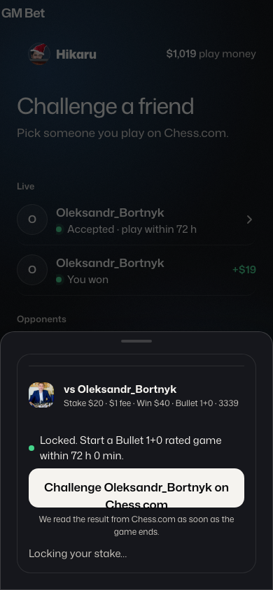
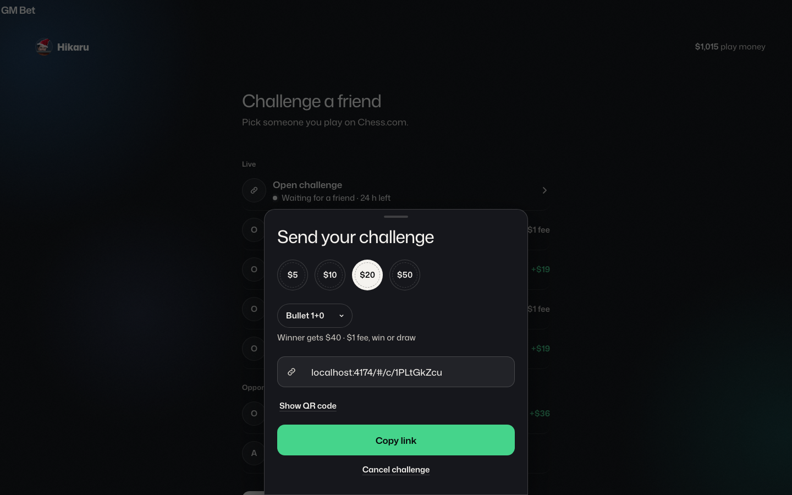
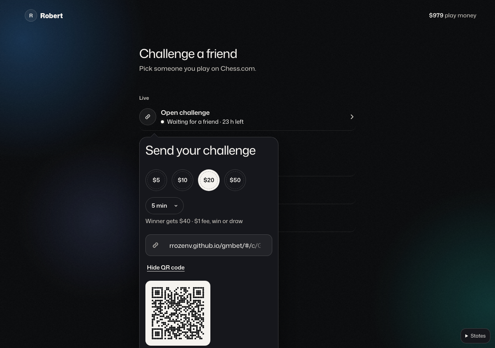

---
cursor:
  subagentId: "bc-4c121e5d-ffff-5d19-9c0a-d4da0689a4a6"
---

# GM Bet QA round 1

**Verdict: NOT READY.** Tested deployed `04ab183` at 390×844, 1440×900, and share at 1280×900. **Blockers: none. Majors: 3. Minors: none.**

**Progress-media artifact commit:** `f1f6e30fe86d2f885b4de1408c04f9a3ae63c9c9`

## Major

1. **Accepted rematch leaves a blocking stale sheet.** Reproduce: finish a game → loser taps Rematch → recipient opens the pending row → Accept. The row becomes active, but “Locking your stake…” remains over Home and intercepts the row until Escape/backdrop. Fix: close the accept sheet after ledger confirmation and navigate to Waiting.
   

2. **A new desktop share uses the wrong template and CTA style.** Reproduce at 1440: signed-in Home → Invite someone new → wait for the link. It remains a centered 480 px bottom-sheet dialog with handle; Copy link is green. Fix: anchor the created bet’s 360 px popover to its optimistic Live row and keep Copy link Bone; reserve green for Accept/Send.
   

3. **Expanded QR popover is cut off at 1280×900.** Reproduce: open an existing challenge → Show QR code. Popover bottom reaches 998 px; Copy link and Cancel are below the viewport. Fix: recompute placement after content resize or constrain height and scroll.
   

All 30 gallery states otherwise match their frames. Public landing/demo/login/dead-link flows pass. The two-player replay completes sign-up, accept, win/loss, rematch (with Escape workaround), and draw. Fees pass: `$0.25/$0.50/$1/$2.50`. The 390 fee is one line below speed; pointer-open Copy has no focus ring; 1440 fits. Returning-browser deploy refresh passes.
